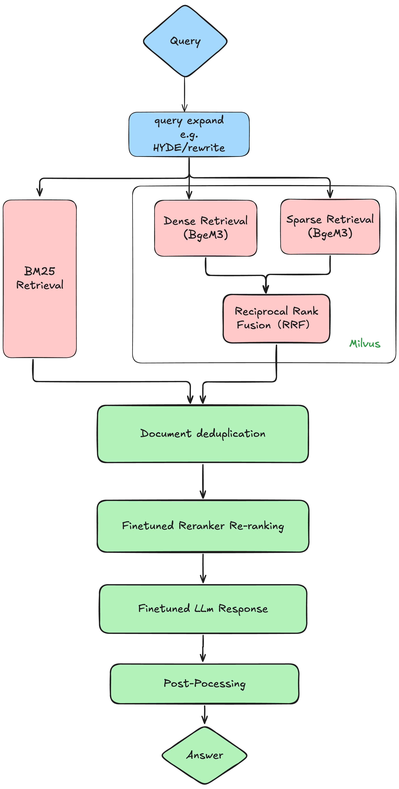
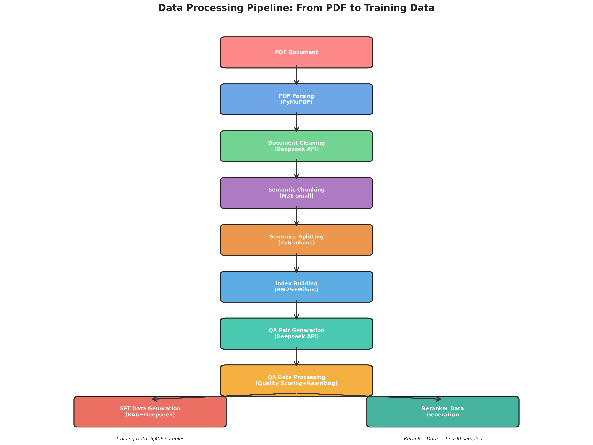
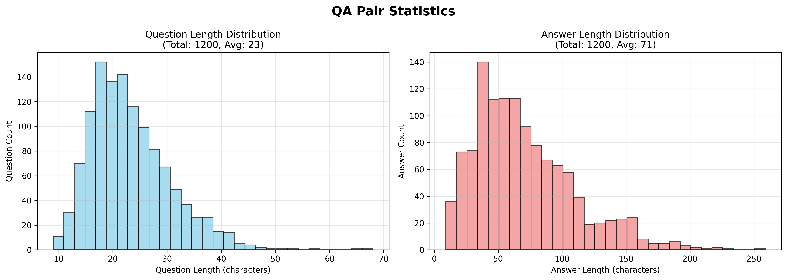
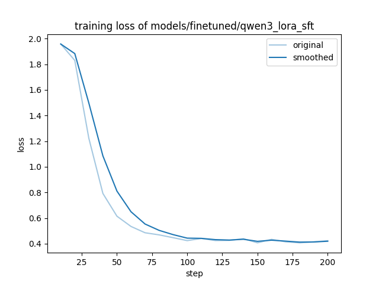
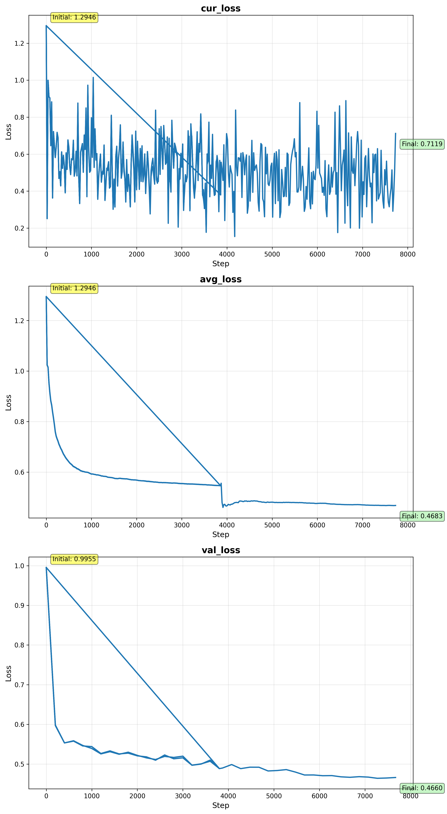
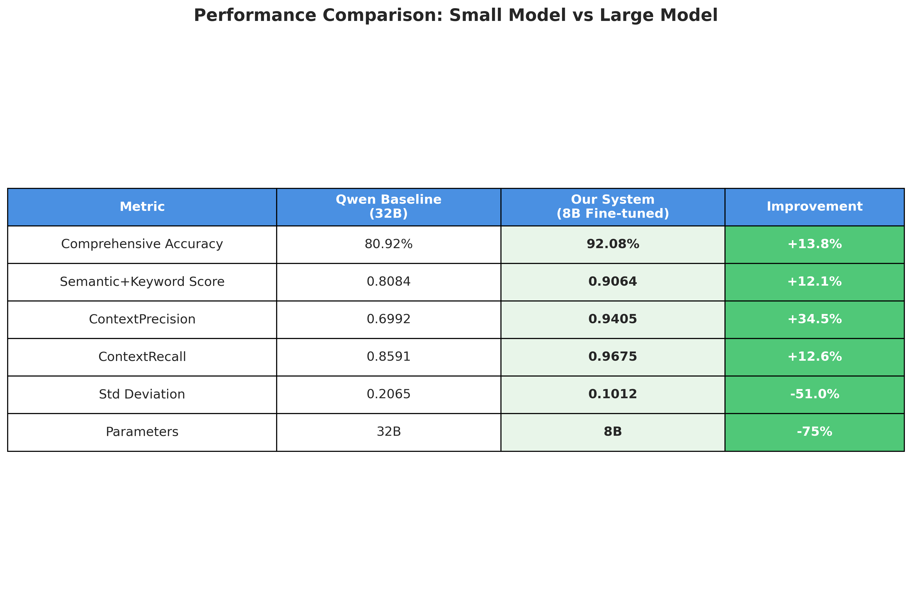
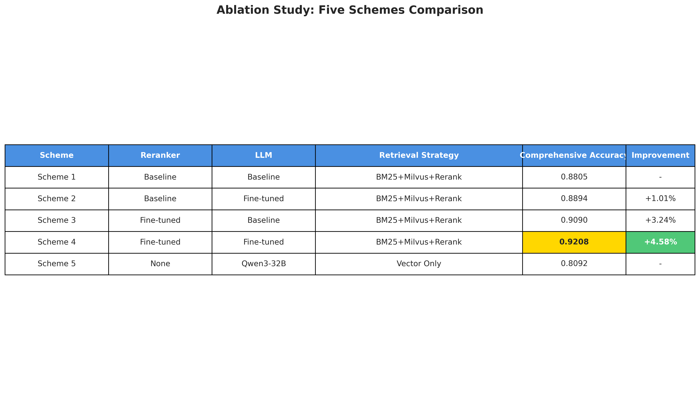
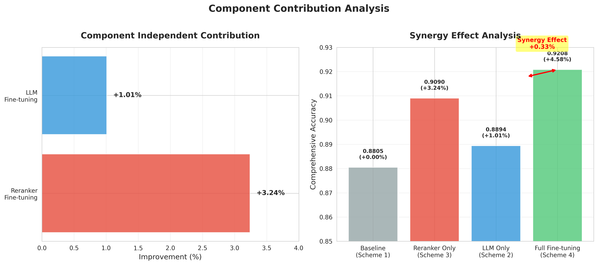
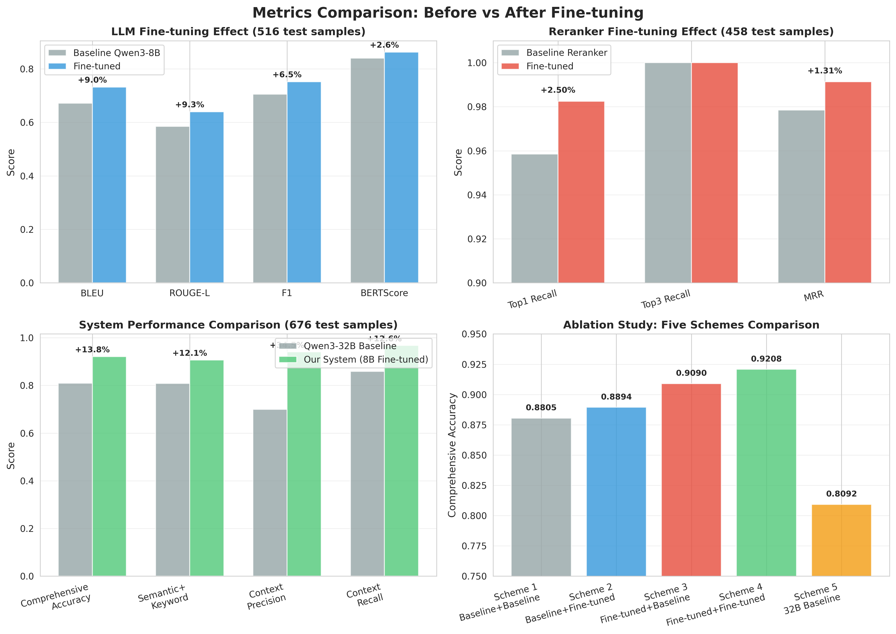

# EvRAG - Enhanced RAG System

一个增强的检索增强生成（RAG）系统，支持多种检索器、重排序器和LLM客户端，提供完整的端到端RAG解决方案。

[](https://www.python.org/downloads/)
[](LICENSE)

---

## 📋 目录

- [项目概述](#项目概述)
- [系统架构](#系统架构)
- [功能特性](#功能特性)
- [快速开始](#快速开始)
- [使用指南](#使用指南)
- [项目结构](#项目结构)
- [核心模块](#核心模块)
- [开发指南](#开发指南)
- [配置说明](#配置说明)
- [常见问题](#常见问题)

---

## 🎯 项目概述

### 演示视频

🎥 **[系统演示视频](resources/video/demo.mp4)** - 观看完整的系统演示和使用教程

### 问题定义

EvRAG是一个面向文档问答的检索增强生成（RAG）系统，旨在解决以下问题：

1. **文档检索挑战**：从大量文档中快速准确地检索相关信息
2. **答案生成质量**：基于检索到的上下文生成准确、相关的答案
3. **多模态支持**：支持文本和图片的联合检索与展示
4. **系统集成**：提供完整的端到端解决方案，包括CLI和Web界面

### 系统范围

- **输入**：用户问题（自然语言查询）
- **处理**：混合检索（BM25 + Milvus）→ 重排序（BGE Reranker）→ LLM生成
- **输出**：答案文本、引用页码、相关图片、性能指标
- **应用场景**：文档问答、知识库查询、用户手册查询等

---

## 🏗️ 系统架构

### 整体架构




### 核心流程

根据系统架构图，EvRAG的RAG流程包含以下步骤：

```
用户查询
    ↓
历史对话处理（多轮对话时，总结历史上下文）
    ↓
┌─────────────────────────────────┐
│  并行检索阶段（混合检索）         │
│  ├─ BM25检索（稀疏检索，关键词） │
│  └─ Milvus检索（向量检索，语义） │
└──────────────┬──────────────────┘
               ↓
        合并与去重
    （基于unique_id去重，
     如有parent_id则获取父文档）
               ↓
        重排序（BGE Reranker）
    （对合并后的文档进行精排，
     选择top-k最相关文档）
               ↓
        上下文构建
    （将top-k文档组织成结构化上下文）
               ↓
    ┌───────────────────────────┐
    │  LLM生成（vLLM服务）      │
    │  - 输入：查询 + 上下文    │
    │  - 输出：带引用的答案     │
    └───────────┬───────────────┘
                ↓
          后处理
    ├─ 提取答案（去除引用标记）
    ├─ 提取引用页码
    └─ 提取相关图片
                ↓
          返回结果
    （答案 + 引用页码 + 相关图片 + 性能指标）
```

**详细说明**：

1. **用户查询输入**：接收用户问题（支持多轮对话）
2. **历史对话处理**：当存在历史对话时，保留最近N轮对话，对更早的历史进行LLM总结
3. **并行检索**：
   - **BM25检索**：基于关键词匹配的稀疏检索，擅长精确匹配
   - **Milvus检索**：基于向量相似度的稠密检索，擅长语义理解
4. **合并去重**：合并两种检索结果，基于`unique_id`去重；如果文档有`parent_id`，从MongoDB获取父文档（包含更完整的上下文）
5. **重排序**：使用微调的BGE-Reranker-v2-m3模型对合并后的文档进行精排，选择top-k最相关的文档
6. **上下文构建**：将重排序后的top-k文档组织成结构化上下文，格式为`【序号】文档内容`
7. **LLM生成**：通过vLLM服务调用微调的Qwen3-8B模型，输入查询和上下文，生成带引用的答案
8. **后处理**：
   - 提取答案文本（去除引用标记如【1】【2】）
   - 提取引用页码（从文档metadata中获取）
   - 提取相关图片（从文档metadata中获取图片信息）
9. **返回结果**：返回答案、引用页码、相关图片和性能指标（检索时间、重排序时间、生成时间等）

### 技术栈

- **检索**：BM25（rank-bm25）、Milvus（向量数据库）
- **重排序**：BGE-Reranker-v2-m3（支持微调）
- **LLM**：Qwen3（支持LoRA微调）
- **框架**：FastAPI（后端服务）、Gradio（前端界面）
- **数据库**：MongoDB（文档存储）

---

## ✨ 功能特性

- 🔍 **混合检索**: BM25（稀疏检索）+ Milvus（向量检索）
- 📊 **智能重排序**: BGE Reranker支持，可微调优化
- 📄 **文档解析**: PDF解析、文本提取、图片提取
- 🤖 **LLM集成**: 支持本地vLLM和远程OpenAI兼容API
- 💬 **RAG问答**: 完整的端到端RAG流程
- 🌐 **Web界面**: Gradio前端，支持流式输出和多轮对话
- 📝 **QA生成**: 自动生成问答对用于训练和评估
- 🛠️ **CLI工具**: 完整的命令行接口
- ⚙️ **配置管理**: 灵活的配置系统（环境变量、YAML文件）
- 📈 **性能监控**: 实时性能指标追踪

---

## 🚀 快速开始

> 💡 **提示**：在开始之前，建议先观看[系统演示视频](resources/video/demo.mp4)了解系统功能和使用方法。

### 环境要求

- **Python**: 3.12+
- **Conda**: Miniconda 或 Anaconda（推荐）
- **CUDA**: 11.8+（可选，用于GPU加速）
- **内存**: 至少16GB RAM（推荐32GB+）
- **GPU**: 推荐使用GPU（用于LLM推理和重排序）

### 安装步骤

#### 1. 克隆仓库

```bash
git clone https://github.com/LeonCheung033/EvRAG.git
cd EvRAG
```

#### 2. 创建Conda环境

```bash
# 创建环境
conda env create -f environment.yml

# 激活环境
conda activate evrag
```

#### 3. 安装依赖

```bash
# 安装生产依赖
pip install -r requirements.txt

# 安装开发依赖（可选）
pip install -r requirements-dev.txt
```

#### 4. 配置环境

```bash
# 复制配置文件
cp config/config.example.yaml config/config.yaml

# 编辑配置文件，设置模型路径等
vim config/config.yaml
```

#### 5. 下载模型（可选）

```bash
# 使用脚本下载所需模型
./scripts/setup/download_models.sh
```

**注意**：模型文件较大，建议提前下载或使用HuggingFace镜像。

---

## 📖 使用指南

### 完整工作流程

根据项目设计，完整的RAG系统构建流程包括以下步骤：

#### 阶段1：数据准备和索引构建

**1.1 数据准备（PDF解析、文档清洗、文档切分）**

**前置步骤：启动MongoDB和语义切分服务**

在执行数据准备之前，必须先启动MongoDB和语义切分服务：

```bash
# 启动MongoDB和语义切分服务（必需）
./scripts/deployment/start_mongodb_semantic_services.sh
```

这个脚本会：
1. 启动MongoDB服务（端口27017）
2. 配置Milvus连接（本地文件模式）
3. 启动语义切分服务（端口6000）

**注意**：
- MongoDB用于存储文档数据，必须在数据准备前启动
- 语义切分服务用于文档的语义切分，也需要提前启动
- 如果服务已在运行，脚本会跳过启动步骤

**执行数据准备**

```bash
# 解析PDF文件，提取文本和图片，并进行清洗和切分
python main.py prepare-data --pdf-path data/Tesla_Manual.pdf
```

这一步会生成：
- `data/processed_docs/raw_docs.pkl` - 原始文档（每页一个Document）
- `data/processed_docs/clean_docs.pkl` - 清洗后的文档
- `data/processed_docs/split_docs.pkl` - 切分后的文档（父文档+子文档）
- MongoDB集合 `manual_text` - 文档存储到数据库

**数据处理Pipeline**：



数据处理包含四个主要阶段：
1. **PDF解析**: 使用PyMuPDF提取文本和图片
2. **文档清洗**: 使用LLM（Doubao API）清洗文档，让句子通顺并按标题归类
3. **文档切分**: 
   - 语义切分（M3E-small模型）→ 生成父文档
   - 句子级切分（RecursiveCharacterTextSplitter）→ 生成子文档（256 tokens, overlap=50）
4. **数据入库**: 保存到MongoDB和pickle文件

**MongoDB使用说明**：

MongoDB在EvRAG系统中用于存储和管理文档数据，支持父子文档关联检索。

**1. MongoDB安装和启动**

```bash
# 方式1：使用项目提供的启动脚本（推荐）
./scripts/deployment/start_mongodb_semantic_services.sh

# 方式2：手动启动MongoDB
# 如果已安装MongoDB，直接启动服务
mongod --dbpath data/mongodb/data --logpath data/mongodb/log/mongodb.log --fork

# 方式3：使用Docker（可选）
docker run -d -p 27017:27017 --name mongodb \
  -v $(pwd)/data/mongodb/data:/data/db \
  mongo:7.0
```

**2. MongoDB配置**

在`config/config.yaml`中配置MongoDB连接信息：

```yaml
mongodb_host: "localhost"      # MongoDB主机地址
mongodb_port: 27017            # MongoDB端口
mongodb_database: "evrag"       # 数据库名称
```

**3. 数据存储结构**

MongoDB中存储的文档结构：

- **数据库**: `evrag`
- **集合**: `manual_text`
- **文档格式**:
  ```json
  {
    "unique_id": "文档唯一标识符",
    "page_content": "文档内容",
    "metadata": {
      "page": 页码,
      "parent_id": "父文档ID（子文档才有）",
      "unique_id": "文档唯一标识符",
      "images_info": [图片信息列表],
      ...
    }
  }
  ```

**4. MongoDB在RAG流程中的作用**

- **文档存储**: 在文档切分阶段，将父文档和子文档保存到MongoDB
- **父子关联检索**: 当检索到的子文档有`parent_id`时，从MongoDB获取父文档（包含更完整的上下文）
- **数据持久化**: 提供比pickle文件更灵活的查询和管理能力

**5. MongoDB管理工具**

```bash
# 检查MongoDB中的数据
python -m src.evrag.parser.check.check_mongodb

# 清空MongoDB集合（重新生成数据时使用）
python -m src.evrag.parser.check.clear_mongodb --collection manual_text

# 获取MongoDB连接字符串
python -m src.evrag.utils.get_mongodb_connection_string
```

**6. 注意事项**

- MongoDB必须在数据准备阶段启动，否则文档无法保存到数据库
- 如果MongoDB未启动，系统会使用pickle文件作为备用存储
- 父子文档关联检索需要MongoDB支持，可以提升检索质量

**1.2 构建检索索引**

```bash
# 构建BM25和Milvus检索索引
python main.py build-index
```

这一步会生成：
- `data/saved_index/bm25retriever.pkl` - BM25索引
- `data/saved_index/milvus.db` - Milvus向量索引

#### 阶段2：训练数据生成

**2.1 生成初始QA对**

```bash
# 从清洗后的文档生成初始QA对
python main.py gen-qa data/processed_docs/clean_docs.pkl \
    --output data/qa_pairs/qa_pair.json
```

**2.2 QA数据处理（质量打分、过滤、问题改写、数据扩充）**

```bash
# 完整流程：质量打分 → 过滤 → 问题改写 → 训练/测试集切分 → 关键词提取 → 添加负样本
python main.py process-qa \
    --qa-pair-path data/qa_pairs/qa_pair.json \
    --output-dir data/qa_pairs
```

这一步会生成：
- `data/qa_pairs/filtered_qa_pair.json` - 过滤后的QA对
- `data/qa_pairs/expand_qa_pair.json` - 问题改写后的QA对
- `data/qa_pairs/train_qa_pair.json` - 训练集
- `data/qa_pairs/test_qa_pair.json` - 测试集

**数据格式参考**：查看 `examples/data/qa_pair_example.json` 了解QA对数据格式。

**2.3 生成微调训练数据**

```bash
# 生成LLM和Reranker的训练数据
python main.py generate-sft-data \
    --train-qa-path data/qa_pairs/train_qa_pair.json \
    --output-dir data
```

这一步会生成：
- `data/qa_pairs/train_data.json` - RAG检索数据
- `data/summary_data/train.json` - LLM训练数据（6,406条）
- `data/summary_data/test.json` - LLM测试数据（516条）
- `data/rerank_data/train.json` - Reranker训练数据（约17,190条）
- `data/rerank_data/dev.json` - Reranker开发集（1,000条）
- `data/rerank_data/test.json` - Reranker测试集（458条）



#### 阶段3：模型微调（使用脚本）

模型微调是提升RAG系统性能的关键步骤。我们使用LoRA方法微调LLM，使用Pointwise Ranking方法微调Reranker。

**3.1 环境准备**

在开始微调之前，需要安装依赖的微调框架：

```bash
# 1. 克隆LLaMA-Factory（LLM微调框架）
cd /path/to/EvRAG
git clone --depth 1 https://github.com/hiyouga/LLaMA-Factory.git LLaMA-Factory-main

# 2. 克隆RAG-Retrieval（Reranker微调框架）
git clone --depth 1 https://github.com/NovaSearch-Team/RAG-Retrieval.git RAG-Retrieval

# 3. 安装LLaMA-Factory
cd LLaMA-Factory-main
pip install -e ".[torch,metrics]" --no-build-isolation
cd ..

# 4. 安装RAG-Retrieval
cd RAG-Retrieval
pip install -e .
cd ..

# 5. 验证安装
python -c "from llamafactory.train.tuner import run_exp; print('✓ LLaMA-Factory已安装')"
python -c "import rag_retrieval; print('✓ RAG-Retrieval已安装')"
```

**3.2 LLM微调（Qwen3-8B）**

**3.2.1 训练配置**

LLM微调使用LoRA（Low-Rank Adaptation）方法，只需要微调0.27%的参数（约2180万个参数），大幅减少显存占用和训练时间。

主要配置参数（`config/finetune/qwen3_lora_sft.yaml`）：
- **基础模型**: Qwen3-8B
- **微调方法**: LoRA (rank=8, target=all)
- **训练数据**: 6,406条训练样本，516条测试样本
- **训练轮数**: 3 epochs
- **学习率**: 2.0e-05（余弦退火）
- **序列长度**: 2048 tokens（优化后，覆盖95%+数据）
- **Batch配置**: per_device=4, gradient_accumulation=4, 6卡GPU
- **有效batch size**: 6 × 4 × 4 = 96

**3.2.2 修改训练脚本**

训练脚本已更新为使用相对路径，如果LLaMA-Factory-main在项目根目录下，通常不需要修改。

如果需要自定义路径，编辑 `scripts/training/train_llm.sh`：

```bash
# 如果LLaMA-Factory不在项目根目录，取消注释并修改以下行：
# LLAMAFACTORY_PATH="/path/to/your/LLaMA-Factory-main"
```

脚本会自动检测项目根目录，并查找 `LLaMA-Factory-main` 目录。

**3.2.3 执行训练**

```bash
# 设置使用的GPU（可选，默认使用0,1,2,3）
export CUDA_VISIBLE_DEVICES="0,1,2,3"

# 执行训练
./scripts/training/train_llm.sh
```

**3.2.4 训练监控**

训练过程中可以通过TensorBoard监控训练进度：

```bash
# 启动TensorBoard
tensorboard --logdir models/finetuned/qwen3_lora_sft/runs
```

访问 `http://localhost:6006` 查看训练曲线。

**训练结果示例**：
- **训练Loss**: 从初始~2.0降到最终0.6494（下降67%）
- **评估Loss**: 0.4125（eval_loss < train_loss，无过拟合）
- **训练时间**: 约2小时16分（6卡GPU）
- **训练速度**: 2.34 samples/s



**3.2.5 模型输出**

微调后的模型保存在：`models/finetuned/qwen3_lora_sft/`

**3.3 Reranker微调（BGE-Reranker-v2-m3）**

**3.3.1 训练配置**

Reranker微调使用Pointwise Ranking方法，将排序问题转化为分类问题。

主要配置参数（`config/finetune/reranker_training.yaml`）：
- **基础模型**: BGE-Reranker-v2-m3
- **微调方法**: Pointwise Binary Cross-Entropy Loss
- **训练数据**: 约17,190条训练样本，1,000条开发集，458条测试集
- **训练轮数**: 2 epochs（数据量增加后可训练更多轮）
- **学习率**: 2e-5（更保守的学习率）
- **Batch配置**: batch_size=8, gradient_accumulation=2
- **有效batch size**: 8 × 2 = 16
- **序列长度**: 4096 tokens（支持长文档）
- **标签**: 0（负样本）/ 1（中等样本）/ 2（正样本）

**3.3.2 修改训练脚本**

训练脚本已更新为使用相对路径，如果RAG-Retrieval在项目根目录下，通常不需要修改。

如果需要自定义路径，编辑 `scripts/training/train_reranker.sh`：

```bash
# 如果RAG-Retrieval不在项目根目录，取消注释并修改以下行：
# RAG_RETRIEVAL_PATH="/path/to/your/RAG-Retrieval"
```

脚本会自动检测项目根目录，并查找 `RAG-Retrieval` 目录。

**3.3.3 Bug修复（重要）**

如果遇到维度不匹配错误，需要修复RAG-Retrieval中的bug：

```bash
# 修复文件1: RAG-Retrieval/rag_retrieval/train/reranker/model_bert.py
# 将第32行的 logits.squeeze() 改为 logits.squeeze(-1)

# 修复文件2: RAG-Retrieval/rag_retrieval/train/reranker/model_llm.py  
# 将第40行的 logits.squeeze() 改为 logits.squeeze(-1)
```

**3.3.4 执行训练**

```bash
# 设置使用的GPU（可选，默认使用0）
export CUDA_VISIBLE_DEVICES="0"

# 执行训练
./scripts/training/train_reranker.sh
```

**3.3.5 训练监控**

```bash
# 启动TensorBoard
tensorboard --logdir models/finetuned/bge_reranker/runs
```

**训练结果示例**：
- **训练Loss**: 从初始1.7446降到最终0.6693（下降61.6%）
- **验证Loss**: 0.6163（验证loss < 训练loss，无过拟合）
- **训练时间**: 约13-14分钟（单卡GPU）
- **Top1 Recall**: 0.9825（微调后）



**3.3.6 模型输出**

微调后的模型保存在：`models/finetuned/bge_reranker/`

**3.4 微调注意事项**

1. **GPU显存要求**：
   - LLM微调：建议至少6张GPU（每张16GB+），或单张32GB+ GPU
   - Reranker微调：单张16GB+ GPU即可

2. **训练时间**：
   - LLM微调：约2-3小时（6卡GPU）或11小时（单卡GPU）
   - Reranker微调：约13-14分钟（单卡GPU）

3. **数据准备**：
   - 确保已完成"阶段2：训练数据生成"
   - 检查训练数据文件是否存在：
     - `data/summary_data/train.json`（LLM训练数据）
     - `data/rerank_data/train.json`（Reranker训练数据）

4. **配置文件**：
   - LLM配置：`config/finetune/qwen3_lora_sft.yaml`
   - Reranker配置：`config/finetune/reranker_training.yaml`
   - 根据你的GPU配置调整batch size和序列长度

5. **常见问题**：
   - **显存不足**：减小`per_device_train_batch_size`或`cutoff_len`
   - **训练速度慢**：增加`dataloader_num_workers`和`preprocessing_num_workers`
   - **过拟合**：减少训练轮数或降低学习率

#### 阶段4：RAG系统使用

**4.1 Web界面使用**

见下方"方式二：Web界面（Gradio）"部分。

#### 阶段5：系统评估

**5.1 RAG系统评估**

```bash
# 评估RAG系统性能
python main.py evaluate-rag \
    --test-data data/qa_pairs/test_qa_pair_verify.json \
    --output-dir rag_test_reports/rag_evaluation
```

**5.2 基线对比评估**

```bash
# 对比基线和微调模型（推荐，自动启动和停止服务）
./scripts/evaluation/run_baseline_finetuned_comparison.sh

# 或者手动执行评估（需要先启动vLLM服务）
# 1. 启动基线vLLM服务（端口8000）
./scripts/deployment/start_vllm_for_evaluation.sh

# 2. 运行基线评估
./scripts/evaluation/run_baseline_evaluation.sh

# 3. 运行微调模型评估（需要先启动微调vLLM服务）
./scripts/deployment/start_vllm_finetuned.sh
./scripts/evaluation/run_finetuned_evaluation.sh

# 4. 停止评估服务
./scripts/deployment/stop_vllm_for_evaluation.sh
```

**5.3 评估结果分析**

```bash
# 分析评估结果（生成对比报告）
python scripts/evaluation/analyze_evaluation_results.py

# LLM模型对比评估
python scripts/evaluation/evaluate_llm_comparison.py

# Reranker模型对比评估
python scripts/evaluation/evaluate_reranker_comparison.py

# Qwen基线模型评估（使用Qwen3-32B）
python scripts/evaluation/run_qwen_baseline_evaluation.py \
    --test-data data/qa_pairs/test_qa_pair.json \
    --output-dir rag_test_reports/qwen_baseline
```

**5.4 实验结果**

我们的RAG系统在676个核对过的质量测试样本上取得了优异的性能：



**核心性能指标**：
- **综合准确率**: 92.08%（vs 基线80.92%，提升13.8%）
- **语义+关键词得分**: 0.9064（vs 基线0.8084，提升12.1%）
- **ContextPrecision**: 0.9405（vs 基线0.6992，提升34.5%）
- **ContextRecall**: 0.9675（vs 基线0.8591，提升12.6%）
- **参数量**: 8B（vs 基线32B，减少75%）



**消融实验结果**：
- 方案1（基线Reranker + 基线LLM）: 0.8805
- 方案2（基线Reranker + 微调LLM）: 0.8894 (+1.01%)
- 方案3（微调Reranker + 基线LLM）: 0.9090 (+3.24%)
- 方案4（微调Reranker + 微调LLM）: **0.9208** (+4.58%)
- 方案5（Qwen3-32B基线）: 0.8092



**组件贡献度**：
- Reranker微调独立贡献: +3.24%
- LLM微调独立贡献: +1.01%
- 协同效应: +0.33%



### 辅助工具命令

以下命令用于数据分析和可视化，不是核心流程的一部分：

```bash
# 分析数据质量
python main.py analyze-data

# 展示文档处理示例
python main.py show-examples --num 5

# 分析SFT数据
python main.py analyze-sft-data

# 绘制训练指标图表
python main.py plot-training-metrics --log-dir logs/finetune/llm
```

### 方式二：Web界面（Gradio）

#### 1. 启动服务（按顺序）

```bash
# 1. 启动vLLM服务（端口8001）
./scripts/deployment/start_vllm_finetuned.sh

# 2. 启动RAG服务（端口8002）
python -m src.evrag.server.rag_server
# 或使用uvicorn:
# uvicorn src.evrag.server.rag_server:app --host 0.0.0.0 --port 8002

# 3. 启动Gradio前端（端口8080）
./scripts/deployment/start_gradio.sh
# 或直接运行:
# python -m src.evrag.server.gradio_app
```

#### 2. 访问界面

打开浏览器访问：`http://localhost:8080`

#### 3. 使用界面

- **输入问题**：在输入框中输入问题
- **调整参数**：可以调整BM25 TopK、Milvus TopK、Reranker TopK等参数
- **流式输出**：开启流式输出开关，实时查看生成过程
- **查看结果**：查看答案、相关图片和性能指标

#### 4. 停止服务

```bash
# 停止Gradio前端
./scripts/deployment/stop_gradio.sh

# 停止vLLM服务
./scripts/deployment/stop_vllm_finetuned.sh

# 停止MongoDB和语义切分服务（如果不再需要）
./scripts/deployment/stop_mongodb_semantic_services.sh
```

### 快速开始（使用预训练模型）

如果你已经有微调好的模型，可以直接使用RAG系统：

#### 步骤1：环境准备

```bash
# 1. 克隆仓库
git clone https://github.com/LeonCheung033/EvRAG.git
cd EvRAG

# 2. 创建环境
conda env create -f environment.yml
conda activate evrag

# 3. 安装依赖
pip install -r requirements.txt
```

#### 步骤2：启动MongoDB（必需）

MongoDB用于存储文档数据，必须在数据准备前启动：

```bash
# 启动MongoDB和语义切分服务
./scripts/deployment/start_mongodb_semantic_services.sh

# 或手动启动MongoDB（如果已安装）
mongod --dbpath data/mongodb/data --logpath data/mongodb/log/mongodb.log --fork
```

**注意**：如果MongoDB未启动，文档切分阶段会失败。确保MongoDB在端口27017上运行。

#### 步骤3：数据准备（如果还没有）

```bash
# 准备PDF文件（示例：Tesla手册）
# 将PDF文件放到 data/ 目录下

# 解析PDF并构建索引
python main.py prepare-data --pdf-path data/Tesla_Manual.pdf
python main.py build-index
```

#### 步骤4：启动服务

```bash
# 1. 启动vLLM服务（端口8001）
./scripts/deployment/start_vllm_finetuned.sh

# 2. 启动RAG服务（端口8002，新终端）
python -m src.evrag.server.rag_server

# 3. 启动Gradio前端（端口8080，新终端）
./scripts/deployment/start_gradio.sh
```

#### 步骤5：使用系统

访问 `http://localhost:8080`，输入问题进行测试。

### 完整复现流程（从零开始）

如果你需要从零开始构建完整的RAG系统（包括模型微调），请按照"完整工作流程"部分的步骤执行。

---

## 📁 项目结构

```
EvRAG/
├── src/evrag/                    # 核心源代码
│   ├── config.py                 # 配置管理
│   ├── retriever/                # 检索器模块
│   │   ├── base.py               # 检索器基类
│   │   ├── bm25_retriever.py     # BM25检索器
│   │   └── milvus_retriever.py   # Milvus检索器
│   ├── reranker/                 # 重排序模块
│   │   ├── base.py               # 重排序器基类
│   │   └── bge_reranker.py       # BGE重排序器
│   ├── parser/                   # 文档解析模块
│   │   ├── pdf_parser.py         # PDF解析器
│   │   └── image_handler.py      # 图片处理
│   ├── client/                   # 客户端模块
│   │   ├── local_client.py       # 本地LLM客户端
│   │   ├── chat_client.py        # RAG问答客户端
│   │   └── ...                   # 其他客户端
│   ├── server/                   # 服务模块
│   │   ├── rag_server.py         # RAG服务（FastAPI）
│   │   └── gradio_app.py         # Gradio前端
│   ├── evaluation/               # 评估模块
│   ├── finetune/                # 微调模块
│   └── utils/                   # 工具函数
├── examples/                     # 示例数据目录
│   └── data/                    # 数据格式示例
│       ├── qa_pair_example.json          # QA对数据格式示例
│       ├── llm_training_example.json     # LLM训练数据格式示例
│       ├── reranker_training_example.jsonl  # Reranker训练数据格式示例
│       └── README.md            # 数据格式说明文档
├── scripts/                      # 脚本目录
│   ├── deployment/              # 部署脚本（启动/停止服务）
│   │   ├── start_gradio.sh              # 启动Gradio前端
│   │   ├── start_vllm_finetuned.sh      # 启动微调vLLM服务
│   │   ├── start_vllm_for_evaluation.sh # 启动评估用vLLM服务
│   │   ├── start_mongodb_semantic_services.sh  # 启动MongoDB和语义切分服务
│   │   ├── stop_gradio.sh               # 停止Gradio前端
│   │   ├── stop_vllm_finetuned.sh       # 停止微调vLLM服务
│   │   ├── stop_vllm_for_evaluation.sh  # 停止评估用vLLM服务
│   │   └── stop_mongodb_semantic_services.sh   # 停止MongoDB和语义切分服务
│   ├── evaluation/              # 评估脚本
│   │   ├── run_baseline_evaluation.sh           # 基线模型评估
│   │   ├── run_finetuned_evaluation.sh          # 微调模型评估
│   │   ├── run_baseline_finetuned_comparison.sh # 基线vs微调对比
│   │   ├── run_qwen_baseline_evaluation.py      # Qwen基线评估
│   │   ├── evaluate_llm_comparison.py           # LLM对比评估
│   │   ├── evaluate_reranker_comparison.py     # Reranker对比评估
│   │   └── analyze_evaluation_results.py        # 评估结果分析
│   ├── training/                # 训练脚本
│   │   ├── train_llm.sh        # LLM微调训练
│   │   └── train_reranker.sh   # Reranker微调训练
│   ├── utils/                   # 工具脚本
│   │   ├── check_code_quality.sh  # 代码质量检查
│   │   ├── monitor_gpu.sh         # GPU监控
│   │   └── test_image_loading.py  # 图片加载测试
│   └── setup/                    # 设置脚本
│       ├── download_models.sh     # 下载模型
│       └── manage_dependencies.sh  # 依赖管理
├── config/                       # 配置文件
│   ├── config.example.yaml       # 配置示例
│   └── config.yaml               # 实际配置（需创建）
├── data/                         # 数据目录
│   ├── saved_images/            # 保存的图片
│   └── processed_docs/          # 处理后的文档
├── tests/                        # 测试
│   ├── unit/                    # 单元测试
│   └── integration/             # 集成测试
├── main.py                       # 主入口（CLI）
├── environment.yml               # Conda环境配置
├── requirements.txt              # 生产依赖
├── requirements-dev.txt          # 开发依赖
└── README.md                     # 项目说明
```

**详细脚本说明**：请参考 [scripts/README.md](scripts/README.md)

---

## 🔧 核心模块

### 检索器 (Retriever)

#### BM25Retriever
- **功能**：基于BM25算法的稀疏检索器
- **特点**：关键词匹配，检索速度快
- **使用场景**：精确关键词匹配的查询

#### MilvusRetriever
- **功能**：基于Milvus的混合检索器
- **特点**：支持稠密向量和稀疏向量，语义相似度检索
- **使用场景**：语义相似查询

### 重排序器 (Reranker)

#### BGEReranker
- **功能**：基于BGE-Reranker-v2-m3模型的重排序器
- **特点**：支持微调，提升领域适应性
- **使用场景**：对检索结果进行精排

### 解析器 (Parser)

#### PDFParser
- **功能**：PDF文档解析
- **特点**：提取文本和图片，支持OCR

#### ImageHandler
- **功能**：图片处理和关联
- **特点**：图片路径管理，图片检索

### 客户端 (Client)

#### LocalLLMClient
- **功能**：本地LLM客户端（vLLM服务）
- **特点**：支持流式输出，高性能推理

#### ChatClient
- **功能**：RAG问答客户端
- **特点**：整合检索、重排序、生成流程

### 服务 (Server)

#### RAGServer (FastAPI)
- **功能**：RAG服务API
- **接口**：
  - `POST /chat` - 非流式聊天
  - `POST /chat/stream` - 流式聊天
  - `GET /health` - 健康检查

#### GradioApp
- **功能**：Web前端界面
- **特点**：支持流式输出、多轮对话、图片展示

---

## 💻 开发指南

### 运行测试

```bash
# 运行所有测试
pytest tests/ -v

# 运行单元测试
pytest tests/unit/ -v

# 运行集成测试
pytest tests/integration/ -v

# 生成覆盖率报告
pytest tests/ --cov=src/evrag --cov-report=html
```

### 代码质量检查

```bash
# 运行代码质量检查
./scripts/utils/check_code_quality.sh

# 格式化代码
ruff format src/

# 检查代码风格
ruff check src/
```

### 工具脚本

```bash
# GPU使用情况监控（实时监控GPU显存、利用率、温度等）
./scripts/utils/monitor_gpu.sh

# 测试图片加载功能（查找包含图片的文档，检查图片路径）
python scripts/utils/test_image_loading.py
```

### 环境设置脚本

```bash
# 下载所需模型文件
./scripts/setup/download_models.sh

# 管理项目依赖（自动生成和更新requirements.txt）
./scripts/setup/manage_dependencies.sh
```

### 代码规范

- **Python风格**：遵循PEP 8
- **类型提示**：使用类型注解
- **文档字符串**：所有公共函数和类都需要文档字符串
- **测试覆盖率**：要求 > 80%，关键模块 > 90%

### 添加新功能

1. 创建功能分支：`git flow feature start feature/NewFeature`
2. 实现功能并添加测试
3. 运行测试确保通过
4. 提交更改：`git commit -m 'feat: Add NewFeature'`
5. 合并到develop分支

---

## ⚙️ 配置说明

### 配置优先级

配置按以下优先级加载（高到低）：

1. **环境变量**
2. **命令行参数**
3. **YAML配置文件** (`config/config.yaml`)
4. **默认值**

### 配置文件

配置文件示例：`config/config.example.yaml`

主要配置项：

- **数据路径**：PDF路径、索引路径、图片保存目录
- **模型路径**：检索模型、重排序模型、LLM模型
- **服务配置**：MongoDB配置、LLM服务地址
- **检索参数**：BM25 TopK、Milvus TopK、Reranker TopK

### 环境变量

可以通过环境变量覆盖配置：

```bash
export LLM_BASE_URL="http://localhost:8001/v1"
export LLM_MODEL_NAME="qwen3_lora_sft"
export MONGODB_HOST="localhost"
export MONGODB_PORT=27017
```

---

## ❓ 常见问题

### Q1: 如何修改LLM服务地址？

**A**: 修改 `config/config.yaml` 中的 `llm_base_url`，或设置环境变量 `LLM_BASE_URL`。

### Q2: 如何调整检索参数？

**A**: 
- CLI方式：使用 `--topk` 参数
- Web界面：在参数配置面板中调整
- 代码方式：修改 `config/config.yaml` 中的默认值

### Q3: 如何添加新的检索器？

**A**: 
1. 继承 `BaseRetriever` 类
2. 实现 `retrieve_topk` 方法
3. 在 `main.py` 中注册使用

### Q4: 如何微调模型？

**A**: 参考 `scripts/training/` 目录下的训练脚本，详细说明请参考 `dev_docs/training/` 目录下的相关文档。

### Q5: 性能优化建议？

**A**:
- 使用GPU加速LLM推理
- 调整检索TopK参数，平衡准确率和速度
- 使用微调模型提升领域适应性
- 启用流式输出提升用户体验

---

## 📚 相关文档

- **项目报告**：[AIAA报告](resources/aiaa.pdf) - 完整的项目技术报告和实验分析
- **演示视频**：[系统演示视频](resources/video/demo.mp4) - 系统功能演示和使用教程
- **公开文档**：[docs/README.md](docs/README.md) - 面向外部用户的文档目录
  - [环境配置指南](docs/environment.md) - 环境设置和配置
  - [开发指南](docs/development.md) - 项目结构和开发规范
  - [数据处理指南](docs/data.md) - 数据处理流程
  - [前端实现指南](docs/frontend.md) - Gradio前端和RAG服务API
- **脚本说明**：[scripts/README.md](scripts/README.md)
- **开发文档**：[dev_docs/README.md](dev_docs/README.md) - 内部开发文档目录索引

---

## 📄 许可证

[添加许可证信息]

---

## 👥 贡献

欢迎贡献！请遵循以下步骤：

1. Fork本项目
2. 创建功能分支 (`git flow feature start feature/AmazingFeature`)
3. 提交更改 (`git commit -m 'feat: Add some AmazingFeature'`)
4. 推送到分支 (`git push origin feature/AmazingFeature`)
5. 创建Pull Request

---

## 📮 联系方式

- **项目地址**: https://github.com/LeonCheung033/EvRAG
- **问题反馈**: [GitHub Issues](https://github.com/LeonCheung033/EvRAG/issues)

---

## 🙏 致谢

感谢所有为这个项目做出贡献的开发者！

特别感谢以下开源项目：
- [rank-bm25](https://github.com/dorianbrown/rank_bm25) - BM25检索
- [Milvus](https://milvus.io/) - 向量数据库
- [BGE](https://github.com/FlagOpen/FlagEmbedding) - 嵌入和重排序模型
- [Gradio](https://gradio.app/) - Web界面框架
- [FastAPI](https://fastapi.tiangolo.com/) - Web框架
